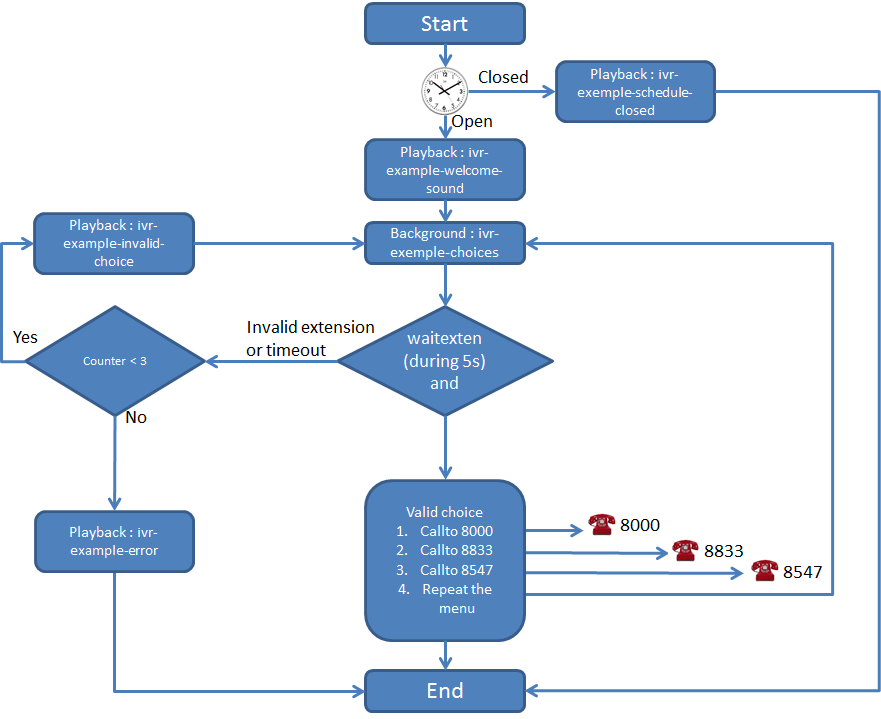
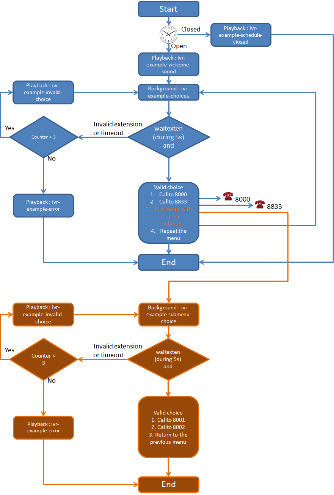

-   [Introduction](#introduction)
-   [Use Case: Minimal IVR](#use-case-minimal-ivr)
    -   [Flowchart](#flowchart)
    -   [Configuration File and
        Dialplan](#configuration-file-and-dialplan)
    -   [IVR external dial](#ivr-external-dial)
    -   [IVR internal dial](#ivr-internal-dial)
-   [Use Case: IVR with a schedule](#use-case-ivr-with-a-schedule)
    -   [Flowchart](#flowchart-1)
    -   [Create Schedule](#create-schedule)
-   [Use Case: IVR with submenu](#use-case-ivr-with-submenu)
    -   [Flowchart](#flowchart-2)
    -   [Configuration File and
        Dialplan](#configuration-file-and-dialplan-1)

Introduction
============

> *Interactive voice response (IVR) is a technology that allows a
> computer to interact with humans through the use of voice and DTMF
> tones input via keypad. In telecommunications, IVR allows customers to
> interact with a company's host system via a telephone keypad or by
> speech recognition, after which they can service their own inquiries
> by following the IVR dialogue.*
>
> \-- Wikipedia

The IVR function is not yet available in graphic mode in Wazo. This
functionality is currently supported only via the
`wazo-confd REST API <confd-api>`{.interpreted-text role="ref"} or using
scripts, also named dialplan.

Use Case: Minimal IVR
=====================

Flowchart
---------

Configuration File and Dialplan
-------------------------------

First step, you need to create a configuration file, that contain an
asterisk context and your IVR dialpan. In our example, both (file and
context) are named
`/etc/asterisk/extensions_extra.d/dp-ivr-example.conf`{.interpreted-text
role="file"}.

Copy all these lines in the newly created configuration file (in our
case, dp-ivr-example) :

    [dp-ivr-example]

    exten = s,1,NoOp(### dp-ivr-example.conf ###)
    same = n,NoOp(Set the context containing your ivr destinations.)
    same = n,Set(IVR_DESTINATION_CONTEXT=my-ivr-destination-context)
    same = n,NoOp(Set the directory containing your ivr sounds.)
    same = n,Set(GV_DIRECTORY_SOUNDS=/var/lib/wazo/sounds/ivr-sounds)
    same = n,NoOp(the system answers the call and waits for 1 second before continuing)
    same = n,Answer(1000)

    same = n,NoOp(the system plays the first part of the audio file "welcome to ...")
    same = n(first),Playback(${GV_DIRECTORY_SOUNDS}/ivr-example-welcome-sound)

    same = n,NoOp(variable "counter" is set to 0)
    same = n(beginning),Set(counter=0)

    same = n,NoOp(variable "counter" is incremented and the label "start" is defined)
    same = n(start),Set(counter=$[${counter} + 1])

    same = n,NoOp(counter variable is now = ${counter})
    same = n,NoOp(waiting for 1 second before reading the message that indicate all choices)
    same = n,Wait(1)
    same = n,NoOp(play the message ivr-example-choices that contain all choices)
    same = n,Background(${GV_DIRECTORY_SOUNDS}/ivr-example-choices)
    same = n,NoOp(waiting for DTMF during 5s)
    same = n,Waitexten(5)

    ;##### CHOICE 1 #####
    exten = 1,1,NoOp(pressed digit is 1, redirect to 8000 in ${IVR_DESTINATION_CONTEXT} context)
    exten = 1,n,Goto(${IVR_DESTINATION_CONTEXT},8000,1)

    ;##### CHOICE 2 #####
    exten = 2,1,NoOp(pressed digit is 2, redirect to 8833 in ${IVR_DESTINATION_CONTEXT} context)
    exten = 2,n,Goto(${IVR_DESTINATION_CONTEXT},8833,1)

    ;##### CHOICE 3 #####
    exten = 3,1,NoOp(pressed digit is 3, redirect to 8547 in ${IVR_DESTINATION_CONTEXT} context)
    exten = 3,n,Goto(${IVR_DESTINATION_CONTEXT},8547,1)

    ;##### CHOICE 4 #####
    exten = 4,1,NoOp(pressed digit is 4, redirect to start label in this context)
    exten = 4,n,Goto(s,start)

    ;##### TIMEOUT #####
    exten = t,1,NoOp(no digit pressed for 5s, process it like an error)
    exten = t,n,Goto(i,1)

    ;##### INVALID CHOICE #####
    exten = i,1,NoOp(if counter variable is 3 or more, then goto label "error")
    exten = i,n,GotoIf($[${counter}>=3]?error)
    exten = i,n,NoOp(pressed digit is invalid and less than 3 errors: the guide ivr-exemple-invalid-choice is now played)
    exten = i,n,Playback(${GV_DIRECTORY_SOUNDS}/ivr-example-invalid-choice)
    exten = i,n,Goto(s,start)
    exten = i,n(error),Playback(${GV_DIRECTORY_SOUNDS}/ivr-example-error)
    exten = i,n,Hangup()

IVR external dial
-----------------

To call the script dp-ivr-example from an external phone, you must
create an incoming call and redirect the call to the script
dp-ivr-example with the command :

-   `POST /extensions {"exten": <DID>, "context": "from-extern"}`
-   `POST /incalls {"destination": {"type": "custom", "command": "Goto(dp-ivr-example,s,1)"}}`
-   `PUT /incalls/{incall_id}/extensions/{extension_id}`

IVR internal dial
-----------------

To call the script dp-ivr-example from an internal phone you must create
an entry in the default context (`xivo-extrafeatures` is included in
`default`). The best way is to add the extension in the file
`/etc/asterisk/extensions_extra.d/xivo-extrafeatures.conf`{.interpreted-text
role="file"}.

    exten => 8899,1,Goto(dp-ivr-example,s,1)

Use Case: IVR with a schedule
=============================

In many cases, you need to associate your IVR to a schedule to indicate
when your company is closed.

Flowchart
---------

Create Schedule
---------------

First step, create your schedule. Give a name to your schedule and
configure the open hours and select the sound which is played when the
company is closed.

In the Closed hours tab, configure all special closed days and select
the sound that indicate to the caller that the company is exceptionally
closed.

The IVR script is now only available during workdays.

-   `POST /schedules`
-   `PUT /incalls/{incall_id}/schedules/{schedule_id}`

Use Case: IVR with submenu
==========================

Flowchart
---------

Configuration File and Dialplan
-------------------------------

Copy all these lines (2 contexts) in a configuration file on your Wazo
server :

    [dp-ivr-example]

    exten = s,1,NoOp(### dp-ivr-example.conf ###)
    same = n,NoOp(Set the context containing your ivr destinations.)
    same = n,Set(IVR_DESTINATION_CONTEXT=my-ivr-destination-context)
    same = n,NoOp(Set the directory containing your ivr sounds.)
    same = n,Set(GV_DIRECTORY_SOUNDS=/var/lib/wazo/sounds/ivr-sounds)
    same = n,NoOp(the system answers the call and waits for 1 second before continuing)
    same = n,Answer(1000)

    same = n,NoOp(the system plays the first part of the audio file "welcome to ...")
    same = n(first),Playback(${GV_DIRECTORY_SOUNDS}/ivr-example-welcome-sound)

    same = n,NoOp(variable "counter" is set to 0)
    same = n(beginning),Set(counter=0)

    same = n,NoOp(variable "counter" is incremented and the label "start" is defined)
    same = n(start),Set(counter=$[${counter} + 1])

    same = n,NoOp(counter variable is now = ${counter})
    same = n,NoOp(waiting for 1 second before reading the message that indicate all choices)
    same = n,Wait(1)
    same = n,NoOp(play the message ivr-example-choices that contain all choices)
    same = n,Background(${GV_DIRECTORY_SOUNDS}/ivr-example-choices)
    same = n,NoOp(waiting for DTMF during 5s)
    same = n,Waitexten(5)

    ;##### CHOICE 1 #####
    exten = 1,1,NoOp(pressed digit is 1, redirect to 8000 in ${IVR_DESTINATION_CONTEXT} context)
    exten = 1,n,Goto(${IVR_DESTINATION_CONTEXT},8000,1)

    ;##### CHOICE 2 #####
    exten = 2,1,NoOp(pressed digit is 2, redirect to 8833 in ${IVR_DESTINATION_CONTEXT} context)
    exten = 2,n,Goto(${IVR_DESTINATION_CONTEXT},8833,1)

    ;##### CHOICE 3 #####
    exten = 3,1,NoOp(pressed digit is 3, redirect to the submenu dp-ivr-submenu)
    exten = 3,n,Goto(dp-ivr-submenu,s,1)

    ;##### CHOICE 4 #####
    exten = 4,1,NoOp(pressed digit is 4, redirect to start label in this context)
    exten = 4,n,Goto(s,start)

    ;##### TIMEOUT #####
    exten = t,1,NoOp(no digit pressed for 5s, process it like an error)
    exten = t,n,Goto(i,1)

    ;##### INVALID CHOICE #####
    exten = i,1,NoOp(if counter variable is 3 or more, then goto label "error")
    exten = i,n,GotoIf($[${counter}>=3]?error)
    exten = i,n,NoOp(pressed digit is invalid and less than 3 errors: the guide ivr-exemple-invalid-choice is now played)
    exten = i,n,Playback(${GV_DIRECTORY_SOUNDS}/ivr-example-invalid-choice)
    exten = i,n,Goto(s,start)
    exten = i,n(error),Playback(${GV_DIRECTORY_SOUNDS}/ivr-example-error)
    exten = i,n,Hangup()

    [dp-ivr-submenu]

    exten = s,1,NoOp(### dp-ivr-submenu ###)
    same = n,NoOp(the system answers the call and waits for 1 second before continuing)
    same = n,Answer(1000)

    same = n,NoOp(variable "counter" is set to 0)
    same = n(beginning),Set(counter=0)

    same = n,NoOp(variable "counter" is incremented and the label "start" is defined)
    same = n(start),Set(counter=$[${counter} + 1])

    same = n,NoOp(counter variable is now = ${counter})
    same = n,NoOp(waiting for 1 second before reading the message that indicate all choices)
    same = n,Wait(1)
    same = n,NoOp(play the message ivr-example-choices that contain all choices)
    same = n,Background(${GV_DIRECTORY_SOUNDS}/ivr-example-submenu-choices)
    same = n,NoOp(waiting for DTMF during 5s)
    same = n,Waitexten(5)

    ;##### CHOICE 1 #####
    exten = 1,1,NoOp(pressed digit is 1, redirect to 8000 in ${IVR_DESTINATION_CONTEXT} context)
    exten = 1,n,Goto(${IVR_DESTINATION_CONTEXT},8000,1)

    ;##### CHOICE 2 #####
    exten = 2,1,NoOp(pressed digit is 2, redirect to 8001 in ${IVR_DESTINATION_CONTEXT} context)
    exten = 2,n,Goto(${IVR_DESTINATION_CONTEXT},8001,1)

    ;##### CHOICE 3 #####
    exten = 3,1,NoOp(pressed digit is 3, redirect to the previous menu dp-ivr-example)
    exten = 3,n,Goto(dp-ivr-example,s,beginning)

    ;##### TIMEOUT #####
    exten = t,1,NoOp(no digit pressed for 5s, process it like an error)
    exten = t,n,Goto(i,1)

    ;##### INVALID CHOICE #####
    exten = i,1,NoOp(if counter variable is 3 or more, then goto label "error")
    exten = i,n,GotoIf($[${counter}>=3]?error)
    exten = i,n,NoOp(pressed digit is invalid and less than 3 errors: the guide ivr-exemple-invalid-choice is now played)
    exten = i,n,Playback(${GV_DIRECTORY_SOUNDS}/ivr-example-invalid-choice)
    exten = i,n,Goto(s,start)
    exten = i,n(error),Playback(${GV_DIRECTORY_SOUNDS}/ivr-example-error)
    exten = i,n,Hangup()
