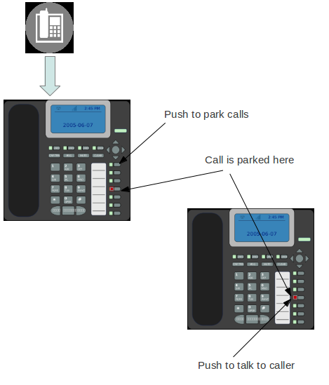

With Wazo it is possible to park calls, the same way you may park your
car in a car parking. If you define supervised keys on a phone set for
all the users of a system, when a call is parked, all the users are able
to see that some one is waiting for an answer, push the phone key and
get the call back to the phone.

You can manage parking with `/parkinglots` endpoints

Using this extension, you may define the parking number used to park
call, the parking lots, whether the system is rotating over the parking
lots to park the calls, enable parking hint if you want to be able to
supervise the parking using phone keys and other system default
parameters.

You have two options in case of parking timeout :

-   Callback the peer that parked this call

    In this case the call is sent back to the user who parked the call.

-   Send park call to the dialplan

    In case you don\'t want to call back the user who parked the call,
    you have the option to send the call to any other extension or
    application. If the parking times out, the call is sent back to the
    dialplan in context `[parkedcallstimeout]`. You can define this
    context in a dialplan configuration file located to
    `/etc/asterisk/extensions_extra.d/`{.interpreted-text role="file"}

    Example:

        [parkedcallstimeout]
        exten = s,1,Noop('park call time out')
        same  =   n,Playback(hello-world)
        same  =   n,Hangup()
